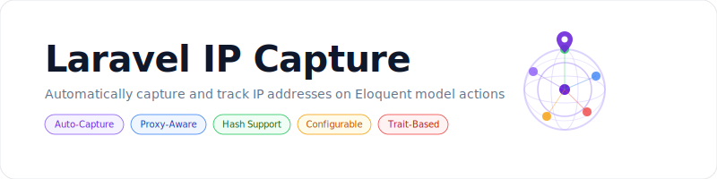

<p align="center">
    <picture>
        <source media="(prefers-color-scheme: dark)" srcset="art/banner-dark.svg">
        <source media="(prefers-color-scheme: light)" srcset="art/banner-light.svg">
        
    </picture>
</p>

<p align="center">
A Laravel package to automatically capture and track IP addresses on Eloquent model actions such as signup, login, update, and deletion.
</p>

<p align="center">
<a href="https://packagist.org/packages/jeremykenedy/laravel-ip-capture"></a>
<a href="https://packagist.org/packages/jeremykenedy/laravel-ip-capture"></a>
<a href="https://github.com/jeremykenedy/laravel-ip-capture/actions/workflows/tests.yml"></a>
<a href="https://github.styleci.io/repos/1194807588?branch=main"></a>
<a href="https://opensource.org/licenses/MIT"></a>
</p>

#### Table of Contents

- [Features](#features)
- [Requirements](#requirements)
- [Installation](#installation)
- [Configuration](#configuration)
- [Usage](#usage)
  - [Add the Trait](#add-the-trait)
  - [Available Methods](#available-methods)
  - [Custom Columns](#custom-columns)
  - [IP Hashing](#ip-hashing)
- [Testing](#testing)
- [License](#license)

## Features

- Automatic IP capture on model events (signup, login, update, delete)
- Tracks 6 configurable IP columns per model
- Simple trait-based integration with any Eloquent model
- Proxy and load balancer aware (Cloudflare, X-Forwarded-For, etc.)
- Optional IP hashing for privacy compliance (SHA-256 or custom algorithm)
- Fluent interface for chaining multiple IP captures
- Configurable column names and enable/disable per column
- Publishable config, migrations, and translations

## Requirements

| Dependency | Version |
|------------|---------|
| PHP | ^8.2 \| ^8.3 |
| Laravel | ^10.0 \| ^11.0 \| ^12.0 \| ^13.0 |

## Installation

```bash
composer require jeremykenedy/laravel-ip-capture
```

Publish the config file:

```bash
php artisan vendor:publish --tag=ip-capture-config
```

Publish and run the migration:

```bash
php artisan vendor:publish --tag=ip-capture-migrations
php artisan migrate
```

## Configuration

The config file is published to `config/ip-capture.php`.

| Option | Type | Default | Description |
|--------|------|---------|-------------|
| `enabled` | bool | `true` | Enable or disable IP capture globally |
| `null_ip` | string | `'0.0.0.0'` | Fallback value when IP cannot be determined |
| `trust_proxies` | bool | `true` | Use Laravel trusted proxy headers first |
| `hash` | bool | `false` | Hash IP addresses before storage |
| `hash_algo` | string | `'sha256'` | Hashing algorithm (any algo supported by `hash()`) |
| `columns` | array | see below | Enable/disable individual IP columns |

### Default Columns

| Column | Default |
|--------|---------|
| `signup_ip_address` | `true` |
| `signup_confirmation_ip_address` | `true` |
| `signup_sm_ip_address` | `true` |
| `admin_ip_address` | `true` |
| `updated_ip_address` | `true` |
| `deleted_ip_address` | `true` |

Environment variables:

```env
IP_CAPTURE_ENABLED=true
IP_CAPTURE_NULL_IP=0.0.0.0
IP_CAPTURE_TRUST_PROXIES=true
IP_CAPTURE_HASH=false
IP_CAPTURE_HASH_ALGO=sha256
```

## Usage

### Add the Trait

Add the `CapturesIp` trait to your User model (or any Eloquent model):

```php
use Jeremykenedy\LaravelIpCapture\Traits\CapturesIp;

class User extends Authenticatable
{
    use CapturesIp;
}
```

### Available Methods

| Method | Description |
|--------|-------------|
| `captureIp()` | Returns the current client IP as a string |
| `setSignupIp()` | Sets the signup IP address column |
| `setSignupConfirmationIp()` | Sets the signup confirmation IP column |
| `setSocialSignupIp()` | Sets the social media signup IP column |
| `setAdminIp()` | Sets the admin action IP column |
| `setUpdatedIp()` | Sets the updated IP column |
| `setDeletedIp()` | Sets the deleted IP column |
| `setIpColumn(string $column)` | Sets a specific IP column by name |
| `getIpColumns()` | Returns all populated IP columns as an array |

All setter methods return `static` for fluent chaining:

```php
$user->setSignupIp()->setAdminIp()->save();
```

### Custom Columns

Add a custom column to the config:

```php
'columns' => [
    'signup_ip_address'  => true,
    'custom_ip_address'  => true,  // your custom column
],
```

Then use `setIpColumn()` to capture:

```php
$user->setIpColumn('custom_ip_address');
```

### IP Hashing

Enable hashing for privacy compliance:

```env
IP_CAPTURE_HASH=true
IP_CAPTURE_HASH_ALGO=sha256
```

When enabled, all captured IPs are hashed before storage. This is a one-way operation.

## Testing

```bash
composer test
```

Or run Pest directly:

```bash
./vendor/bin/pest --ci
```

## License

This package is open-sourced software licensed under the [MIT license](LICENSE).
