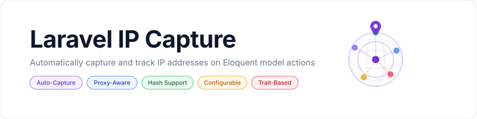

<p align="center">
    <picture>
        <source media="(prefers-color-scheme: dark)" srcset="art/banner-dark.svg">
        <source media="(prefers-color-scheme: light)" srcset="art/banner-light.svg">
        
    </picture>
</p>

<p align="center">
A Laravel package to automatically capture and track IP addresses on Eloquent model actions such as signup, login, update, and deletion.
</p>

<p align="center">
<a href="https://packagist.org/packages/jeremykenedy/laravel-ip-capture"></a>
<a href="https://packagist.org/packages/jeremykenedy/laravel-ip-capture"></a>
<a href="https://github.com/jeremykenedy/laravel-ip-capture/actions/workflows/tests.yml"></a>
<a href="https://github.styleci.io/repos/1194807588?branch=main"></a>
<a href="https://opensource.org/licenses/MIT"></a>
</p>

#### Table of Contents

- [Framework Support](#framework-support)
- [Requirements](#requirements)
- [Installation](#installation)
- [Quick Start](#quick-start)
  - [Blade](#blade)
  - [Livewire](#livewire)
  - [Vue](#vue)
  - [React](#react)
  - [Svelte](#svelte)
- [Features](#features)
- [Usage](#usage)
  - [Add the Trait](#add-the-trait)
  - [Available Methods](#available-methods)
  - [Automatic Capture](#automatic-capture)
  - [Custom Columns](#custom-columns)
- [Privacy](#privacy)
  - [IP Hashing](#ip-hashing)
  - [Anonymizing](#anonymizing)
  - [Masking in the UI](#masking-in-the-ui)
- [Configuration](#configuration)
- [Changing Frameworks](#changing-frameworks)
- [Artisan Commands](#artisan-commands)
- [Publishing Assets](#publishing-assets)
- [Testing](#testing)
- [Upgrading](#upgrading)
- [License](#license)

## Framework Support

One CSS framework and one frontend are active at a time, selected in config or with the artisan commands.

| | Blade | Livewire | Vue | React | Svelte |
|---|---|---|---|---|---|
| **Tailwind CSS v4** | Yes | Yes | Yes | Yes | Yes |
| **Bootstrap 5** | Yes | Yes | Yes | Yes | Yes |
| **Bootstrap 4** | Yes | Yes | Yes | Yes | Yes |

The Bootstrap 5 markup sticks to utilities available since 5.0, so it does not need 5.3.

## Requirements

| Dependency | Version |
|------------|---------|
| PHP | 8.2 or newer |
| Laravel | 10, 11, 12, 13 |

Laravel 10 and 11 have reached end of life upstream. They remain supported here, and the test matrix still covers them.

## Installation

```bash
composer require jeremykenedy/laravel-ip-capture
```

Run the installer to publish the config and the views for your chosen frameworks:

```bash
php artisan ip-capture:install
```

The installer detects an existing installation and stops rather than overwriting your config and published views. Use `ip-capture:update` to change frameworks, or pass `--force` to reinstall from scratch.

Add the IP columns to your table:

```bash
php artisan migrate
```

The migration ships with the package, so it runs without publishing anything. Publish it only if you want to edit it:

```bash
php artisan vendor:publish --tag=ip-capture-migrations
```

## Quick Start

Add the trait to your model, capture an address, and render it.

```php
use Jeremykenedy\LaravelIpCapture\Traits\CapturesIp;

class User extends Authenticatable
{
    use CapturesIp;
}
```

```php
$user->setSignupIp()->save();
```

### Blade

```blade
<x-ip-capture::ip-table :model="$user" />

<x-ip-capture::ip-badge :ip="$user->signup_ip_address" label="Signup" />
```

### Livewire

Publish the component and its view, then render it with the model:

```bash
php artisan vendor:publish --tag=ip-capture-livewire
```

```blade
<livewire:ip-table :model="$user" />
```

The published component lands in `app/Livewire/IpTable.php` and reloads the model when the table is refreshed.

### Vue

```bash
php artisan vendor:publish --tag=ip-capture-js
```

```vue
<script setup>
import IpTable from '../js/vendor/ip-capture/vue/IpTable.vue'
</script>

<template>
    <IpTable :rows="rows" theme="tailwind" />
</template>
```

### React

```jsx
import IpTable from '../js/vendor/ip-capture/react/IpTable'

<IpTable rows={rows} theme="bootstrap5" />
```

### Svelte

```svelte
<script>
    import IpTable from '../js/vendor/ip-capture/svelte/IpTable.svelte'
</script>

<IpTable {rows} theme="bootstrap4" />
```

Every JavaScript component takes the same `rows` array, which you can build from the model:

```php
use Jeremykenedy\LaravelIpCapture\Support\IpCapture;

$rows = collect(IpCapture::enabledColumns())
    ->map(fn (string $column) => [
        'column'   => $column,
        'label'    => IpCapture::columnLabel($column),
        'value'    => filled($user->{$column})
            ? (IpCapture::shouldMaskDisplay() ? IpCapture::mask($user->{$column}) : $user->{$column})
            : IpCapture::emptyLabel(),
        'captured' => filled($user->{$column}),
    ])
    ->all();
```

`all()` matters: the components expect an array, and a `Collection` serialises to an object. Each row carries a `value` either way, because the components render it in both branches.

## Features

- Trait based integration with any Eloquent model
- Optional automatic capture on model events, off by default
- Proxy and load balancer aware, with a configurable header list
- Optional hashing with a salt, and optional anonymizing to a /24 or /64 network
- Blade, Livewire, Vue, React and Svelte components in Tailwind, Bootstrap 5 and Bootstrap 4
- Install, update and switch commands for changing frameworks
- Configurable table, column names, column length and per column enable flags
- Publishable config, migration, views, translations and JavaScript components

## Usage

### Add the Trait

```php
use Jeremykenedy\LaravelIpCapture\Traits\CapturesIp;

class User extends Authenticatable
{
    use CapturesIp;
}
```

### Available Methods

| Method | Description |
|--------|-------------|
| `captureIp()` | Returns the current client IP as a string |
| `setSignupIp()` | Sets the signup IP address column |
| `setSignupConfirmationIp()` | Sets the signup confirmation IP column |
| `setSocialSignupIp()` | Sets the social media signup IP column |
| `setAdminIp()` | Sets the admin action IP column |
| `setUpdatedIp()` | Sets the updated IP column |
| `setDeletedIp()` | Sets the deleted IP column |
| `setIpColumn(string $column, ?string $ip = null)` | Sets a specific column, optionally to an address you supply. A supplied address goes through the same hashing and anonymizing as a resolved one |
| `getIpColumns()` | Returns all populated IP columns as an array |

Every setter returns the model, so they chain:

```php
$user->setSignupIp()->setAdminIp()->save();
```

A setter writes nothing when its column is disabled in config, and nothing at all when `enabled` is false. Reading `getIpColumns()` keeps working either way.

### Automatic Capture

Capture can be wired to Eloquent events instead of being called by hand. It is off by default, so adding the trait never writes a column on its own.

```env
IP_CAPTURE_AUTO=true
```

```php
'auto_capture' => [
    'enabled' => true,

    'events' => [
        'creating' => 'signup_ip_address',
        'updating' => 'updated_ip_address',
    ],
],
```

Three things are worth knowing before you switch it on:

- Only events that fire before Eloquent writes the row can be used, because capture assigns an attribute. Those are `saving`, `creating`, `updating`, `deleting` and `restoring`. Anything else, `created` or `saved` for instance, is ignored rather than mapped to a capture that could never reach the database.
- Events are wired when the model class boots, so the configuration has to be in place before the model is first used.
- When the current context has no address to offer, such as a queued job or a console command, an address already stored in the column is kept rather than being overwritten with the null IP. A column the model never loaded is left alone too, since what it holds is unknown.

The `deleting` event is not in the shipped map on purpose. A soft delete writes only its own columns and a hard delete drops the row, so an address captured there never reaches the database. Call `setDeletedIp()` and save the model yourself when you need that column:

```php
$user->setDeletedIp()->save();
$user->delete();
```

### Custom Columns

Add the column to config and to your table, then capture into it by name:

```php
'columns' => [
    'signup_ip_address' => true,
    'reset_ip_address'  => true,
],
```

```php
$user->setIpColumn('reset_ip_address');
```

The bundled migration creates every enabled column, shipped ones first and anything you added after them.

Two limits are worth knowing, both from the migration reading configuration rather than recording what it did:

- Rollback drops the six shipped columns it finds on the table, whether or not this migration created them. A column another package had already created is dropped too. Rollback does not touch columns you added through config.
- `table` and `after_column` have to stay put once the migration has run. Changing `table` afterwards means rollback inspects the new table and leaves the columns on the old one.
- The migration does nothing when the table is absent, rather than failing, so the package can be installed in an application that has no `users` table. It is still recorded as run, so a table created by a later migration does not get the columns. Run the migration again with `php artisan migrate:refresh --path=...` in that case, or add the columns in your own migration.
- `after_column` is only honoured when that column exists on the table. The columns are appended otherwise.

## Privacy

### IP Hashing

```env
IP_CAPTURE_HASH=true
IP_CAPTURE_HASH_ALGO=sha256
IP_CAPTURE_HASH_SALT=some-value-you-keep
```

Hashing is one way. Set the salt before you start storing digests, because changing it changes every digest produced from then on.

The digest has to fit the column. `sha256` produces 64 characters, which matches the shipped column length exactly. `sha512` produces 128, so the column has to be wider before you choose it:

```env
IP_CAPTURE_COLUMN_LENGTH=128
```

That setting only applies to columns the bundled migration creates, because the
migration skips a column that is already there. On an installation that has
already migrated, widen the existing columns yourself:

```php
Schema::table('users', function (Blueprint $table) {
    $table->string('signup_ip_address', 128)->nullable()->change();
});
```

Laravel 10 needs `doctrine/dbal` for `change()`. Laravel 11 and newer do not.

An algorithm the PHP `hash()` function does not support still fails the capture, but with an `InvalidArgumentException` naming the offending value and config key rather than the opaque `ValueError` that `hash()` raises. Set it once and check it before you deploy.

### Anonymizing

```env
IP_CAPTURE_ANONYMIZE=true
```

Drops the host part of the address before it is stored, keeping a /24 for IPv4 and a /64 for IPv6. `203.0.113.45` becomes `203.0.113.0`, and `2001:db8:85a3:1:1:8a2e:370:7334` becomes `2001:db8:85a3:1::`. Anonymizing runs before hashing, so the two can be combined.

### Masking in the UI

```env
IP_CAPTURE_DISPLAY_MASK=true
```

Shows `203.0.113.45` as `203.0.113.xxx` in the Blade components without changing what is stored. Individual components can override it:

```blade
<x-ip-capture::ip-table :model="$user" :mask="false" />
```

The Vue, React and Svelte components render the rows they are handed, so mask
there when you build the rows:

```php
'value' => IpCapture::mask($user->{$column}),
```

## Configuration

The config file is published to `config/ip-capture.php`.

| Option | Type | Default | Description |
|--------|------|---------|-------------|
| `enabled` | bool | `true` | Master switch. When off, every capture resolves to the null IP |
| `null_ip` | string | `'0.0.0.0'` | Value stored when no address can be determined |
| `columns` | array | six columns, all enabled | Enable or disable individual IP columns |
| `trust_proxies` | bool | `true` | Use the address Laravel resolved before reading headers |
| `headers` | array | seven server keys | Server keys inspected, in order, to resolve the client address |
| `hash` | bool | `false` | Hash addresses before storage |
| `hash_algo` | string | `'sha256'` | Any algorithm supported by `hash()` |
| `hash_salt` | string | `''` | Prepended before hashing so digests resist a rainbow table |
| `anonymize` | bool | `false` | Keep only the network part of the address |
| `auto_capture.enabled` | bool | `false` | Wire capture to Eloquent model events |
| `auto_capture.events` | array | creating, updating | Map of model event to column |
| `table` | string | `'users'` | Table the bundled migration adds columns to |
| `after_column` | string | `'password'` | Column the new columns are placed after |
| `column_length` | int | `64` | Length of each IP column |
| `css_framework` | string | `'tailwind'` | `tailwind`, `bootstrap5` or `bootstrap4` |
| `frontend` | string | `'blade'` | `blade`, `livewire`, `vue`, `react` or `svelte` |
| `views.enabled` | bool | `true` | Register the view namespace and the Blade components |
| `display.mask` | bool | `false` | Mask the host part in the shipped components |
| `display.empty_label` | string | `'-'` | Shown for a column that holds no address |

### Default Columns

| Column | Default |
|--------|---------|
| `signup_ip_address` | `true` |
| `signup_confirmation_ip_address` | `true` |
| `signup_sm_ip_address` | `true` |
| `admin_ip_address` | `true` |
| `updated_ip_address` | `true` |
| `deleted_ip_address` | `true` |

### Environment Variables

```env
IP_CAPTURE_ENABLED=true
IP_CAPTURE_NULL_IP=0.0.0.0
IP_CAPTURE_TRUST_PROXIES=true
IP_CAPTURE_HASH=false
IP_CAPTURE_HASH_ALGO=sha256
IP_CAPTURE_HASH_SALT=
IP_CAPTURE_ANONYMIZE=false
IP_CAPTURE_AUTO=false
IP_CAPTURE_TABLE=users
IP_CAPTURE_AFTER_COLUMN=password
IP_CAPTURE_COLUMN_LENGTH=64
IP_CAPTURE_CSS=tailwind
IP_CAPTURE_FRONTEND=blade
IP_CAPTURE_VIEWS=true
IP_CAPTURE_DISPLAY_MASK=false
IP_CAPTURE_DISPLAY_EMPTY=-
```

`IP_CAPTURE_CSS` and `IP_CAPTURE_FRONTEND` fall back to `UI_KIT_CSS` and `UI_KIT_FRONTEND` when they are not set, so the package follows a laravel-ui-kit installation without extra configuration.

## Changing Frameworks

After installation, use **update** or **switch** to change frameworks without losing configuration.

### Update (Interactive)

The update command walks through framework selection with an interactive menu:

```bash
php artisan ip-capture:update
```

Or pass options directly:

```bash
php artisan ip-capture:update --css=bootstrap5 --frontend=vue
```

| Option | Values | Description |
|--------|--------|-------------|
| `--css` | `tailwind`, `bootstrap5`, `bootstrap4` | Change CSS framework |
| `--frontend` | `blade`, `livewire`, `vue`, `react`, `svelte` | Change frontend framework |

### Switch (Quick)

```bash
php artisan ip-capture:switch --css=bootstrap5
php artisan ip-capture:switch --frontend=livewire
php artisan ip-capture:switch --css=tailwind --frontend=vue
```

Republish the views after changing the CSS framework so any copy you published matches:

```bash
php artisan vendor:publish --tag=ip-capture-views --force
```

After switching to a JavaScript frontend, run `npm run build`.

Both commands persist the choice by writing `IP_CAPTURE_CSS` and
`IP_CAPTURE_FRONTEND` to `.env`. If you published the config and replaced those
`env()` calls with literal values, the literal wins on the next process and the
command's change does not survive. Edit `config/ip-capture.php` in that case.
The commands say so when there is no `.env` to write to.

## Artisan Commands

| Command | Description |
|---------|-------------|
| `ip-capture:install` | Fresh install with interactive prompts. Detects existing installation. |
| `ip-capture:update` | Update framework selection interactively. Does not overwrite config. |
| `ip-capture:switch` | Quick framework switch via flags. |

### Install Options

| Flag | Description |
|------|-------------|
| `--css=` | CSS framework: `tailwind`, `bootstrap5`, `bootstrap4` |
| `--frontend=` | Frontend: `blade`, `livewire`, `vue`, `react`, `svelte` |
| `--force` | Skip reinstall confirmation when already installed |

Passing both `--css` and `--frontend` skips the framework prompts, so all three commands run unattended. `ip-capture:install` also needs `--force` once `config/ip-capture.php` exists, because it stops rather than overwrite a config and published views it did not write.

## Publishing Assets

| Tag | Destination |
|-----|-------------|
| `ip-capture-config` | `config/ip-capture.php` |
| `ip-capture-migrations` | `database/migrations` |
| `ip-capture-lang` | `lang/vendor/ip-capture` |
| `ip-capture-views` | `resources/views/vendor/ip-capture`, for the active CSS framework |
| `ip-capture-views-tailwind` | `resources/views/vendor/ip-capture`, Tailwind markup |
| `ip-capture-views-bootstrap5` | `resources/views/vendor/ip-capture`, Bootstrap 5 markup |
| `ip-capture-views-bootstrap4` | `resources/views/vendor/ip-capture`, Bootstrap 4 markup |
| `ip-capture-js` | `resources/js/vendor/ip-capture` |
| `ip-capture-livewire` | `app/Livewire/IpTable.php` and `resources/views/livewire/ip-table.blade.php` |

Published views are flat, so `resources/views/vendor/ip-capture/ip-table.blade.php` overrides the shipped view for whichever framework is active.

## Testing

```bash
composer test
```

Or run the tools directly:

```bash
./vendor/bin/pest --ci
./vendor/bin/pint --test
./vendor/bin/phpstan analyse
```

`composer check` runs the linter, static analysis and the test suite in that order.

## Upgrading

See [UPGRADING.md](UPGRADING.md). No public method, config key or publish tag has been removed, so upgrading within 1.x is a composer update.

## License

This package is open-sourced software licensed under the [MIT license](LICENSE).
